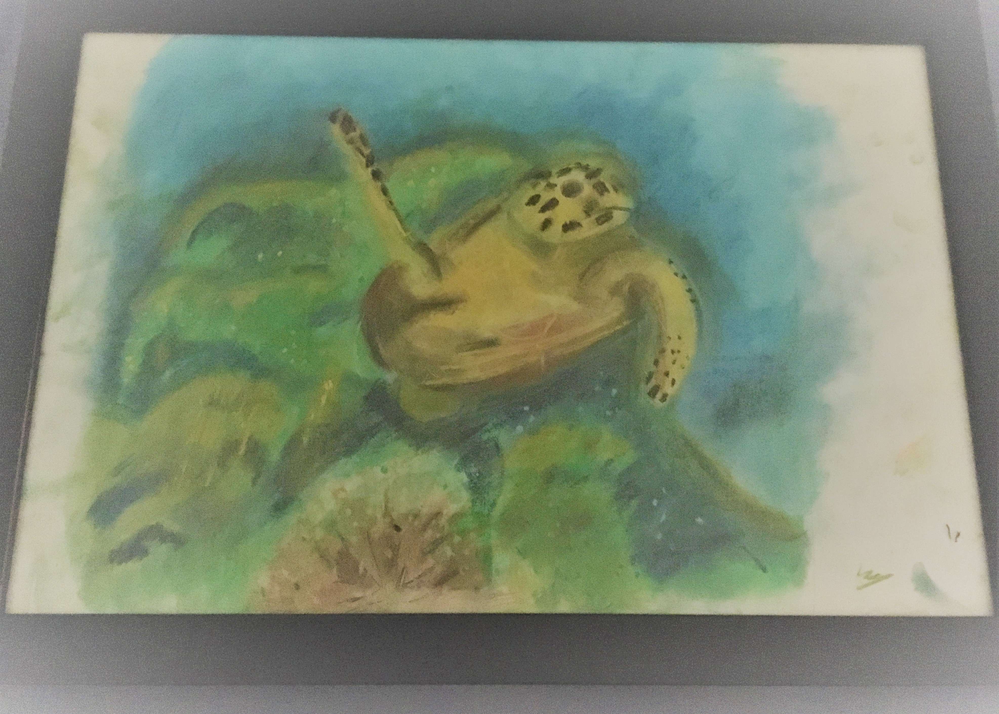
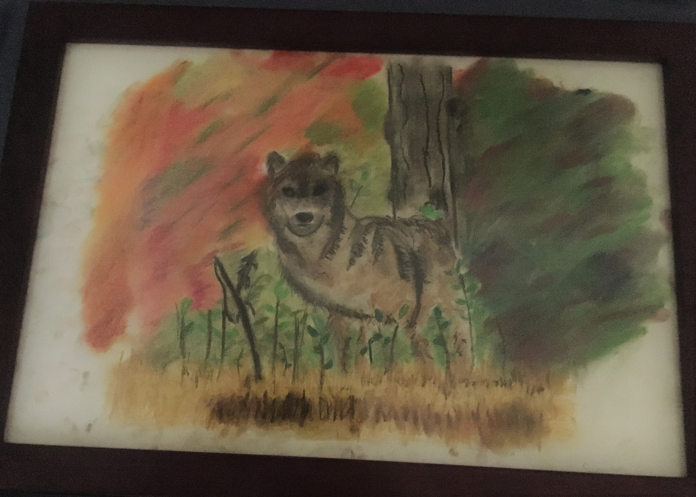
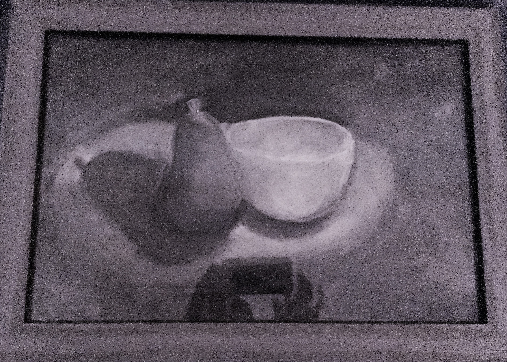

## Welcome to my fairfax community page

### Hi welcome to my my attempt and making STEM into STEAM by adding Art into my STEM. I am a nature lover, what you see below are some of the pictures I have done inspired by nature. 

#### Tell me what you think mailto:

##### Let me start with this beautiful turtle

##### How about a wolf ?

##### Next How about a pencil shade of some fruits. I learnt this in my art class.

#### How do you like it ? Oh, want a high profile picture, contact me
